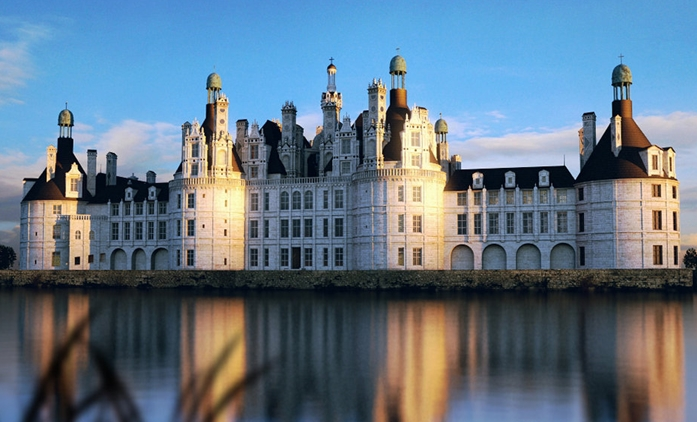

# Academia de Magia Arché Lys

A Academia de Magia Arché Lys é uma renomada instituição de ensino mágico localizada na cidade de Aurora. Fundada há séculos, é reconhecida como uma das primeiras academias de magia do continente de Valaris e célebre por sua excelência acadêmica.

Além do ensino tradicional, todos os alunos são formados para se tornarem membros da força militar ativa de Aurora, integrando o conhecimento arcano à defesa da cidade.

## Governança e Estrutura

A cada geração, a academia é regida por um conselho conhecido como a **Tábula dos 10**, composto pelo reitor e por professores de referência, que são pesquisadores renomados do arcano.

### O Conselho da Academia

-   **Reitor:** Marie Gramado (Halfling Mago Camponês)
    -   A presença de Marie é uma importante força apaziguadora contra as constantes intrigas entre os arquimagos da academia.

-   **Arquimagos (Representantes das Escolas):**
    > **Nota:** É de conhecimento geral que existem seis arquimagos, mas apenas quatro são conhecidos publicamente.
    -   Azamar (Evocação)
    -   Szass Tam (Necromancia)
    -   Ethara (a definir)
    -   (a definir)

-   **Chefe do Treinamento Militar:** Robert Greyrat (Guerreiro)
    -   Responsável pela formação marcial dos alunos.

-   **Chefe da Biblioteca:** Owlin **Simon P. Jones** (Arquimago Pesquisador)
    -   Considerado o centro do conhecimento de Celeste e guardião dos arquivos da academia.

## Escolas de Magia

### Escolas Principais
*   **Evocação:** Liderada pelo Arquimago Azamar.
*   **Necromancia:** Liderada pelo Arquimago Szass Tam.
*   *(Outras escolas principais a serem definidas)*

### Escolas Raras
> **Nota:** Estas escolas são raras, com poucos materiais e praticantes conhecidos.

-   **Graviturgia:** (Conhecimento adquirido por Julius)
-   **Magia Selvagem**
-   **Cronomancia**
-   **Emomancia**
-   **Magia Feérica:** (Relacionada a produtos e criaturas do Reino Feérico que chegam a Aurora)
