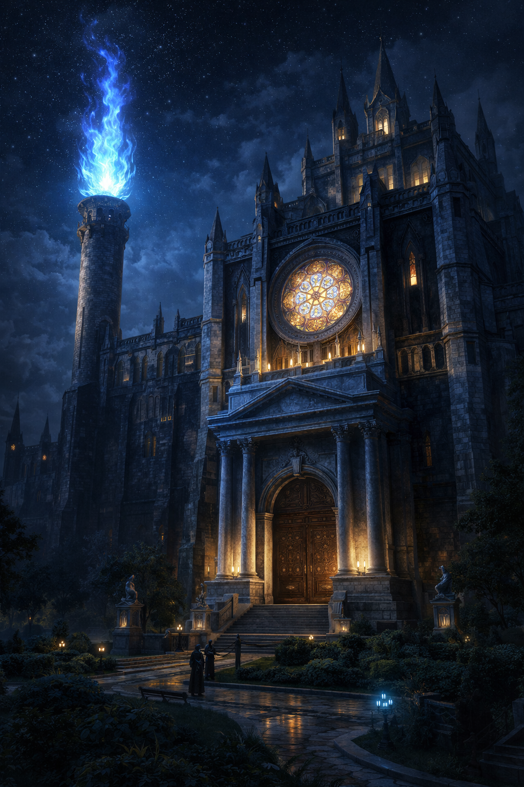

# A Biblioteca de Aurora — *Sanctum Sapios*

A *Sanctum Sapios*, ou "Santuário da Sabedoria", não é apenas a maior biblioteca de Aurora, mas um dos mais importantes repositórios de conhecimento em todo o continente de Valaris. É uma instituição que transcende a mera coleta de livros, atuando como um bastião contra o esquecimento e uma fonte de poder arcano.

### História

A fundação da *Sanctum Sapios* remonta a séculos, logo após a fundação da própria cidade de Aurora. Erguida por um consórcio dos primeiros magos da Academia Arché Lys, a biblioteca foi concebida com um propósito duplo: servir como um centro de aprendizado incomparável e proteger o conhecimento mais vital e perigoso do mundo contra guerras, catástrofes e a corrupção do tempo.

Seu primeiro bibliotecário e arquiteto-chefe, o arquimago eladrin Lyraenor, imbuiu as fundações da biblioteca com magias primordiais, garantindo sua longevidade e segurança. Diz-se que o próprio feitiço de *Private Sanctum* que a protege é uma versão aprimorada e permanente, tecida com o poder do próprio Lyraenor.

### Acesso e Funcionamento

A biblioteca opera sob regras estritas para preservar seu acervo e a segurança de seus visitantes.

-   **Taxa de Entrada:** O acesso ao grandioso hall e ao primeiro andar, que contém conhecimentos gerais, mapas e histórias públicas, requer o pagamento de uma modesta taxa.
-   **O Preço do Conhecimento:** Para acessar os andares superiores, onde o conhecimento se torna mais específico e poderoso, um visitante de primeira viagem deve fazer uma oferenda. A biblioteca aceita duas formas de pagamento: um item de conhecimento (um livro raro, um mapa antigo, um pergaminho de magia) ou um segredo — uma informação valiosa e desconhecida, que é magicamente extraída e armazenada nos arquivos da biblioteca.

### O Exterior da Biblioteca

A *Sanctum Sapios* é uma estrutura colossal de mármore branco e obsidiana, com cerca de 100 metros de altura, que se destaca na paisagem urbana de Aurora. Sua arquitetura mescla a elegância élfica com a robustez anã, resultando em um edifício de beleza imponente.

A característica mais notável são os quatro centros de fogo arcano em seu teto. Todos queimam com uma chama azul hipnótica e fria, visível de quase toda a cidade. Um em especial se destaca, posicionado na parte frontal esquerda, ergue-se como um imponente pilar de fogo, um farol conhecido como a **Lux Sapientiae** (Luz da Sabedoria) Também é conhecido que essas chamas mudam de cor para sinalizar eventos importantes em toda a cidade, embasando a população sobre o estado atual da magia e dos acontecimentos em Aurora. A última manifestação dessa mudança de cor ocorreu durante a celebração da fundação da cidade e quando um item foi oferecido à biblioteca por um enigmático visatante da biblioteca.

A entrada principal é um grande portal de madeira e ferro sob um pórtico de mármore. Acima dele, um enorme vitral octagonal exibe os símbolos das oito grandes escolas de magia. A biblioteca é cercada por um extenso jardim, onde sentinelas Warforged patrulham e fazendo a segurança e conservação da biblioteca.

#### As Cores da Lux Sapientiae

A cor da chama do farol indica o estado atual da cidade de Aurora e da magia no reino:

-   **Azul Frio — *Lux Sapientiae***: Estado normal, simbolizando a ordem e o equilíbrio da cidade.
-   **Branco Luminoso**: Anuncia uma grande descoberta, revelação ou evento acadêmico de grande importância.
-   **Violeta Profundo**: Indica que um ritual arcano de alto risco está em andamento.
-   **Verde Esmeralda**: Alerta para uma crise, praga ou contaminação mágica, representando um desequilíbrio arcano.
-   **Dourado Radiante**: Sinaliza um decreto oficial ou uma convocação suprema da Academia de Magia.
-   **Vermelho Carmesim**: Adverte sobre uma ameaça militar imediata ou um ataque direto à cidade.
-   **Negro Ígneo**: Representa uma catástrofe arcana de nível existencial, uma ameaça de grande magnitude.

### O Interior da Biblioteca

Ao cruzar o pórtico, os visitantes entram em um hall monumental que se estende por todos os três andares. O espaço é vasto e preenchido por um silêncio reverente, quebrado apenas pelo eco suave de passos e o virar de páginas. A iluminação não vem de tochas, mas de esferas de luz arcana que flutuam no ar, movendo-se lentamente pelos corredores e mudando de cor para indicar as diferentes seções.

No centro do piso de mármore polido do hall, está gravado o grandioso símbolo da Tábula dos 10, o conselho regente da Academia de Magia Arché Lys. Pelos corredores, a diversidade de funcionários é evidente: High Elves, com suas "Mãos Mágicas", atuam como curadores e assessores; Warforgeds robustos garantem a segurança; e Gnomos das Rochas podem ser vistos em pequenas oficinas, absortos em suas pesquisas.

### O Bibliotecário-Chefe

O atual guardião da *Sanctum Sapios* é o arquimago Owlin **Simon P. Jones**. Mais do que um simples bibliotecário, ele é um estudioso renomado e o protetor dos segredos mais profundos da academia. Simon é um Owlin, uma criatura alada com traços de coruja, cuja capacidade de voar silenciosamente pelos altos corredores da biblioteca se tornou lendária. Conhecido por sua vasta sabedoria e por uma personalidade ao mesmo tempo acolhedora e enigmática, ele decide quem é digno de acessar os conhecimentos mais restritos do santuário.

