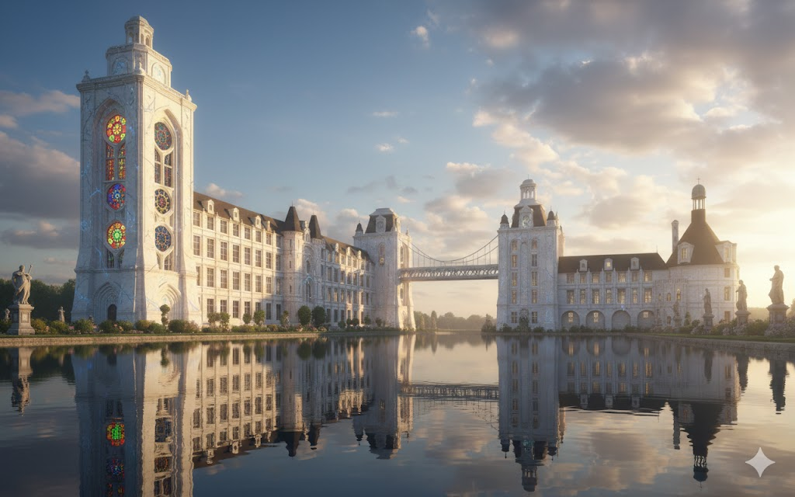

# Academia de Magia Arché Lys

A Academia de Magia Arché Lys é uma renomada instituição de ensino mágico localizada na cidade de Aurora. Fundada há séculos, é reconhecida como uma das primeiras academias de magia do continente de Valaris e célebre por sua excelência acadêmica.

Além do ensino tradicional, a Academia também divide a formação de seus alunos entre o aprendizado arcano e o treinamento militar, preparando-os para se tornarem membros ativos da força de defesa de Aurora. Embora o foco principal seja a magia, a integração com a defesa militar é vista como essencial para a segurança e feita para um seleto grupo de estudantes, que recebem treinamento especializado da arte de dança das lâminas e estratégias de combate.

## O Exterior da Academia

A Academia Arché Lys é uma obra-prima arquitetônica que combina a grandiosidade da magia com a arte da construção. O complexo é formado por dois imensos edifícios espelhados, conectados por jardins exuberantes e uma elegante passarela suspensa no segundo andar. A estrutura principal se destaca por sua fachada de mármore branco entrelaçada com veios de quartzo azul que, sob a luz do sol, parecem pulsar com energia arcana.

O elemento mais marcante é a **Torre dos Fundadores**, que se eleva majestosamente na parte esquerda do prédio principal, dominando a paisagem com seus quase 100 metros de altura. A torre é adornada com símbolos arcanos gravados em relevo e janelas de vitrais octagonais que representam as oito escolas de magia. À noite, essas janelas brilham com luz própria, criando um espetáculo de cores que pode ser visto de toda Aurora. É nesta torre que se realizam as reuniões da Tábula dos 10 e onde fica o escritório do reitor.

Ao norte, ergue-se o prédio da Escola Militar, um reflexo arquitetônico do edifício principal, mas com uma torre posicionada ao lado direito. Entre os dois prédios, estende-se um vasto jardim com caminhos de pedra polida, fontes ornamentadas com estátuas de água dançante e esculturas de antigos magos e guerreiros que fundaram a academia. Uma grande passarela suspensa, decorada com runas de proteção, conecta os dois prédios no segundo andar.

Diante da fachada principal, um lago sereno se estende como um espelho líquido. Suas águas são cristalinas e imóveis na maior parte do tempo, refletindo perfeitamente a imponente construção da academia. Ao amanhecer e ao entardecer, a superfície do lago captura o brilho dos vitrais e do mármore, criando um reflexo duplo que parece transportar a academia para um reino etéreo. Dizem que o lago foi encantado pelos fundadores para servir como uma barreira mágica adicional, e que qualquer perturbação em suas águas alerta os guardiões da academia.

## O Interior da Academia

Ao cruzar o portal principal de madeira maciça entalhada com runas de boas-vindas, os visitantes adentram o **Grande Corredor Central**, o coração pulsante da academia. Este corredor se estende por mais de 100 metros, conectando as diversas alas do edifício. Suas paredes são revestidas de mármore polido que reflete a luz natural que entra através de grandes janelas arqueadas.

O teto do corredor é uma maravilha arquitetônica: uma série de arcos góticos parabólicos que se entrelaçam formando uma abóbada celestial. Entre os arcos, afrescos mágicos retratam cenas da história da magia em Valaris — grandes batalhas, descobertas arcanas e a fundação da própria academia. Esses afrescos não são estáticos; eles se movem sutilmente, como se fossem memórias vivas capturadas no teto.

O piso é de mármore negro e branco em padrão xadrez, com símbolos arcanos em dourado nos centros de certos quadrados. Esses símbolos funcionam como guias mágicos: quando um estudante pisa sobre eles com a intenção de ir a um local específico, o símbolo brilha suavemente, indicando a direção.

Ao longo do corredor, imponentes colunas de pedra branca se erguem, cada uma gravada com os nomes de estudantes ilustres que passaram pela academia. Esferas de luz flutuam próximas ao teto, movendo-se lentamente e ajustando sua intensidade conforme a luz natural muda ao longo do dia.

Das laterais do corredor, portas ornamentadas levam a salas de aula, laboratórios alquímicos, bibliotecas menores e áreas comuns. Cada porta é única, decorada com símbolos que indicam o tipo de conhecimento ensinado além dela. O ambiente é constantemente preenchido pelo murmúrio de conversas estudantis, o farfalhar de páginas de tomos antigos e, ocasionalmente, o estalo de uma magia sendo praticada em algum laboratório distante.

## Governança e Estrutura

A cada geração, a academia é regida por um conselho conhecido como a **Tábula dos 10**, composto pelo reitor e por professores de referência, que são pesquisadores renomados do arcano.

### O Conselho da Academia

-   **Reitor:** Marie Gramado (Halfling Mago Camponês)
    -   A presença de Marie é uma importante força apaziguadora contra as constantes intrigas entre os arquimagos da academia. Sua origem humilde e ascensão ao cargo mais alto da instituição inspiram estudantes de todas as origens.

-   **Arquimagos (Representantes das Oito Escolas de Magia):**
    > **Nota:** Cada escola de magia é representada por um arquimago no conselho, totalizando oito mestres das artes arcanas. Alguns deles preferem manter suas identidades em segredo, trabalhando nas sombras da academia.

    -   **Abjuração:** Ethra Dalas
    -   **Conjuração:** Nevron
    -   **Adivinhação:** Yaphyll
    -   **Encantamento:** Nybor
    -   **Evocação:** Aznar Thrul
    -   **Ilusão:** Nymor Thrul
    -   **Necromancia:** Szass Tam
    -   **Transmutação:** Maligor

-   **Chefe do Treinamento Militar:** Robert Greyrat (Guerreiro)
    -   Responsável pela formação marcial dos alunos selecionados. Veterano de inúmeras campanhas, Robert combina disciplina militar com profundo respeito pela magia, criando uma ponte entre as duas forças da academia.

-   **Chefe da Biblioteca Sanctum Sapios:** Owlin **Simon P. Jones** (Arquimago Pesquisador)
    -   Considerado o centro do conhecimento de Celeste e guardião dos arquivos da academia. Sua vasta sabedoria e capacidade de voar silenciosamente pelos corredores da biblioteca tornaram-no uma figura lendária entre os estudantes.

## Escolas de Magia

A Academia Arché Lys oferece instrução completa nas oito escolas tradicionais de magia, cada uma liderada por um arquimago especialista. Além disso, a academia mantém registros e alguns poucos praticantes de magias raras e exóticas.

### Escolas Principais (As Oito Tradições)

-   **Abjuração:** A arte da proteção e defesa mágica, liderada pelo Arquimago Ethra Dalas.
-   **Conjuração:** Magia de invocação e criação, sob a tutela do Arquimago Nevron.
-   **Adivinhação:** A escola da percepção e conhecimento do futuro, dirigida pelo Arquimago Yaphyll.
-   **Encantamento:** Magia que influencia mentes e emoções, comandada pelo Arquimago Nybor.
-   **Evocação:** A manipulação de energia bruta e elemental, liderada pelo Arquimago Aznar Thrul.
-   **Ilusão:** A arte do engano e das falsas realidades, sob o comando do Arquimago Nymor Thrul.
-   **Necromancia:** O estudo da vida, morte e energia negativa, liderada pelo Arquimago Szass Tam.
-   **Transmutação:** Magia de transformação e alteração da realidade física, dirigida pelo Arquimago Maligor.

### Escolas Raras e Exóticas

> **Nota:** Estas escolas são raras, com poucos materiais de estudo e praticantes conhecidos. A academia mantém registros limitados e alguns artefatos relacionados a essas tradições mágicas.

-   **Graviturgia:** A manipulação da gravidade e forças fundamentais. Julius Montclair possui conhecimento nesta escola rara.
-   **Magia Selvagem:** Magia imprevisível e caótica, difícil de controlar e estudar.
-   **Cronomancia:** A manipulação do tempo, considerada uma das artes mais perigosas e proibidas.
-   **Emomancia:** Magia baseada em emoções puras, pouco compreendida pela academia tradicional.
-   **Magia Feérica:** Relacionada ao Reino Feérico e ao Plano das Fadas. A academia recebe ocasionalmente produtos e criaturas deste reino para estudo.

## A Fundadora

### Lysandra Aetherius

Lysandra Aetherius foi a visionária arquimaga que fundou a Academia de Magia Arché Lys há séculos. Uma das primeiras magistas a estabelecer uma instituição dedicada ao ensino e à pesquisa mágica estruturada no continente de Valaris, Lysandra acreditava que o conhecimento arcano não deveria ser guardado em segredo por poucos, mas compartilhado e expandido através de gerações.

Sua visão era criar um espaço onde o conhecimento arcano pudesse ser explorado em todas as suas formas, promovendo tanto a excelência individual quanto o avanço coletivo da magia. O nome "Arché Lys" significa "Princípio da Luz" em línguas antigas, refletindo sua crença de que a magia era a luz que iluminaria o caminho da civilização.

Diz-se que foi Lysandra quem estabeleceu o sistema da Tábula dos 10, garantindo que todas as escolas de magia tivessem representação igual no conselho, evitando assim que uma única tradição dominasse a academia. Seu legado perdura não apenas nas pedras do edifício, mas na própria filosofia que guia a instituição até hoje.

## Política e Acesso

A Academia Arché Lys, apesar de seu ideal de compartilhamento de conhecimento, enfrenta desafios relacionados à acessibilidade:

-   **Magia e Privilégio:** Historicamente, o estudo de magia na academia tem sido associado a recursos financeiros, uma vez que livros raros, componentes mágicos e taxas de matrícula são proibitivos para a maioria da população.
-   **Exclusão dos Camponeses:** Tradicionalmente, indivíduos de origem camponesa têm pouco ou nenhum acesso à academia, perpetuando uma divisão social baseada no conhecimento arcano.
-   **Bolsas de Marie Gramado:** Como reitor, Marie Gramado tem trabalhado ativamente para mudar essa realidade, concedendo bolsas de estudo para estudantes talentosos de origens humildes, tanto das cidades quanto das áreas rurais. Sua própria história como um mago camponês que ascendeu ao mais alto cargo da academia serve como inspiração.
-   **A Lenda do Arquimago Camponês:** Circulam histórias entre o povo sobre a existência de um poderoso arquimago de origem camponesa que nunca frequentou a academia, mas cujo poder rivaliza com os maiores mestres. Essa lenda alimenta esperanças e debates sobre a natureza do talento arcano.
